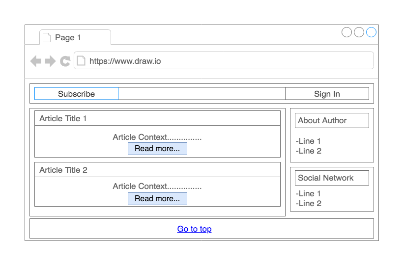
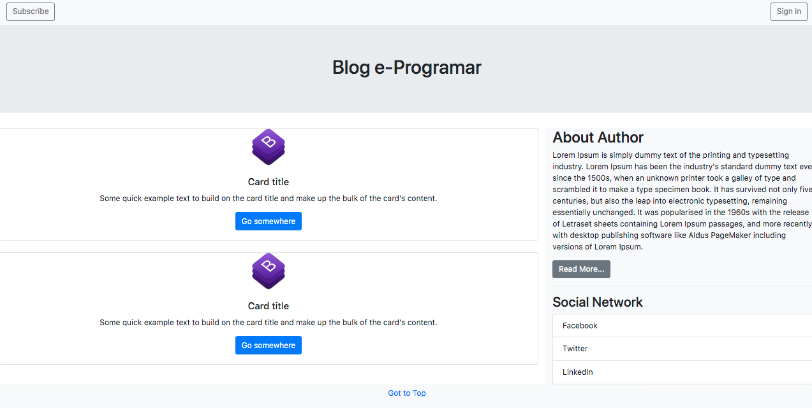
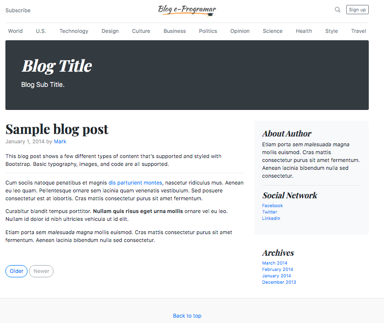

# Kotlin Web MVC with Spring Framework

This project is about e-Programar course: **Kotlin Web with Spring Framework**,    
that will be published on Udemy.

**Stack**   

* Kotlin
* Gradle 
* Spring Web `WEB`
* Spring Data JPA `SQL`
* H2 Database `SQL`
* Thymeleaf `Template Engines`
* Bootstrap

### Prototype Mockup

### Prototype Bootstrap

### Template

